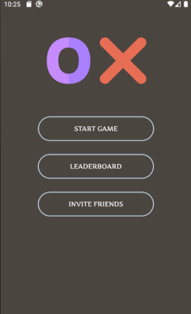
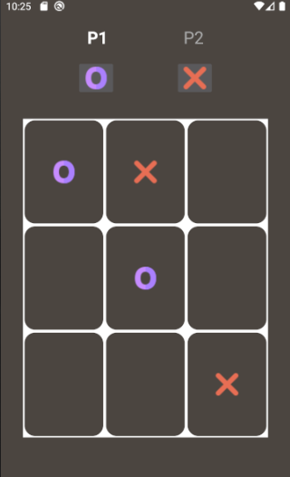

# TicTacToe
TicTacToe is a game for two players, X and O, who take turns marking the spaces in a 3×3 grid.
This is an android application which is build using kotlin. The player who succeeds in placing three of their marks in a diagonal, horizontal, or vertical row is the winner.

This is an android application which is built using kotlin.

## Main Screen

## Game Screen

## Winning Screen

# Features
- [x] Multiplayer Game
- [x] Animations shown on winning
- [x] Leaderboard to view top scores
- [x] Option to add player names
- [x] Option to restart game on winning/draw
- [x] Option to invite others by sending message
- [x] Single player game 

# Getting Started
You need to have android studio installed on your device and create an Android Virtual Device to run full Android OS and test the application.

## Installation
* Clone the repository in a directory of your choice
* Open the TicTacToe folder with Android Studio
* Build the gradle file
* Now you can test the application on either android virtual device or your android device

Note - Single player game implementation is done in SinglePlayerGame Branch.

Icons made by <a href="http://www.freepik.com/" title="Freepik">Freepik</a> from <a href="https://www.flaticon.com/" title="Flaticon"> www.flaticon.com</a>
